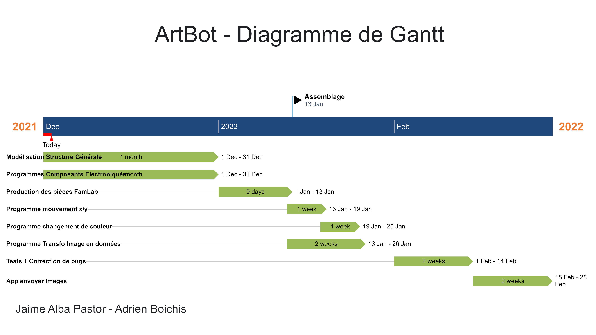

# Cahier des Charges - ArtBot

## Inspiration

## Objectifs

Notre objectif est de créer un produit qui:

1. puisse combler un besoin, c'est à dire qui soit utile.
2. puisse avoir diverses applications.
3. puisse être transporté facilement.
4. soit créatif.

Après beaucoup de réfléxion et de brainstorming, nous avons pensé à un robot de dessin / imprimante à stylo.  
En effet les objectifs sont bien comblés :

1. en tant qu'étudiants, imprimer ses cours à cout réduit aurait été bien utile pendant le confinement.
2. autres applications:
   - signatures à distance beaucoup plus réalistes qu'un imprimante conventionnelle.
   - dessins d'annonces et flyers.
   - dessins de graphiques et courbes de fonctions très belles (nottament pour les cours d'analyse).
3. peut être facilement rangé dans une mallette de travail.
4. dessiner des oeuvres d'art magnifiques.

## Fonctionnalités

Les fonctionnalité de ArtBot:

- Changement automatique de couleurs.
- Plusieurs formats d'impression disponibles (A4 ou plus)

## Étapes

[Etapes](Etapes-Taches.md) et [Repartition des Tâches](https://sharing.clickup.com/l/h/4-32571374-1/226c80c2a30dcb4)

Le diagramme de Gantt:

## Ressources

Matériel utilisé **[ici](Matériel.md)**
