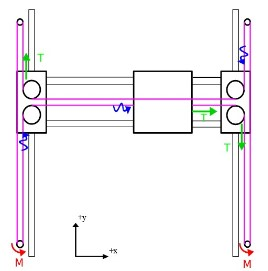
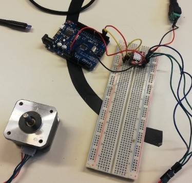

# Rapports de Scéance - Jaime Alba Pastor G2

## Séance 0

Ce rapport correspond au travail fourni avant la première séance de TD.

- Ecriture du [README](../README.md)
- Ecriture des [étapes et tâches du project](../Documentation/Etapes-Taches.md)
- Ecriture du [CDC](../Documentation/Cahier_des_charges.md)

- Creation du [WorkSpace ClickUp](https://sharing.clickup.com/l/h/4-32571374-1/226c80c2a30dcb4)
- Répartition des tâches dans [WorkSpace ClickUp](https://sharing.clickup.com/l/h/4-32571374-1/226c80c2a30dcb4)
- Diagramme de Gantt dans [Diagramme-Gantt](../Documentation/Images/Diagramme-Gantt.png)

## Séance 1

### Mercredi 01/12

J'ai préféré consacrer la première séance à l'organisation globale du projet, c'est à dire:

- Quelle forme et mécanismes le robot va avoir.
- Les [composants électroniques](../Documentation/Matériel.md) nécessaires.

**1. Mécanisme de ArtRobot.**

On s'est inspirés d'un système de robot de traçage [H-Robot](http://www.doublejumpelectric.com/projects/core_xy/2014-07-15-core_xy/) qui utilise une seule courrie dentée pour bouger selon les axes x et y.   

Il y a aussi un autre système similaire appelé CoreXY qui est supposé être un peu plus précis mais plus complexe à construire, donc on a décidé de conserver le H-Robot puisque nous voulons aussi implémenter le changement de couleur.

Pour le changement de couleurs on a pensé à **une croix** à laquelle seraient attachés les **différents stylos de couleurs à chacune des extrémités**. Lorsque l'on souhaiterait changer de couleur, on ferait **tourner la croix** grâce à un servo-moteur et ainsi positionner la couleur correspondante en direction de la feuille, prêt pour dessiner.

**2. Composants Electroniques**

Pour mener à bien ce projet on a besoin de 2 moteurs STEP ainsi que deux moteurs SERVO munis des drivers
correspondants. (listés dans les [matériels](../Documentation/Matériel.md))

### Jeudi 02/12

Je suis revenu le jour suivant avec mon groupe car j'avais très envie de continuer le projet.
J'ai passé une grande partie du temps à _collecter_ les matériaux d'un projet de l'année dernière (c'était un chaos !!).

- J'ai pu y trouver petits boutons qui pourraient servir comme indicateurs au cas où la partie mobile collisionne avec les autres composants du robot. J'ai donc décidé de les incorporer prochainement.
- Nous avons besoin d'une courroie dentée d'environ 2m40, j'ai trouvé quelques courrois dentées (plus petites) que je vais agrafer entre elles pour faire une grande courroie.
- Finalement j'ai aussi récupéré des roulements linéaires à billes, des tubes en fer, deux moteurs NEMA-17 step bipolaires et les drivers.

Pour finir, j'ai commencé à tester le moteur NEMA-17 avec un [petit programme](../Tests/Programmes-Composantes/StepMotorTest1.ino) récuperé dans le superbe cours de M.Masson.

