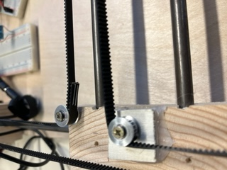
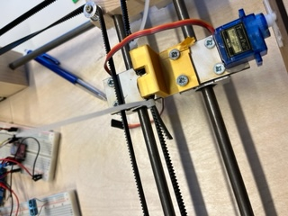
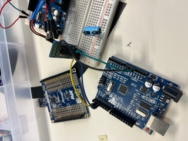
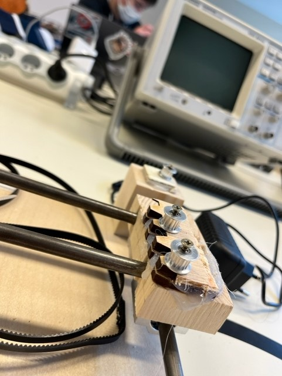
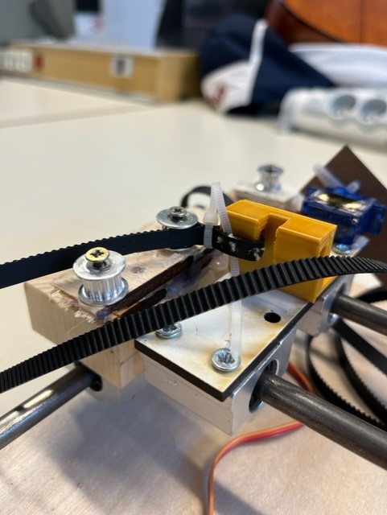

# Rapport de séances  - Boichis Adrien SHN

## Rapport de la séance 1 (01/12/2021)

### Ce rapport correspond au travail fourni pendant la première scéance de TD.

- shématisation des pièces et calcul de la taille de notre machine en x et y, c'est a dire dessin de toute nos pièces sur papier pour pouvoir ensuite les modliser sur onshape en 3d 

- liste du materiel necessaire 
- élaboration du system de changement de couleur 
- 
- 

## Rapport de la séance 2 (15/12/2021)
### Ce rapport correspond au travail fourni pendant la seconde scéance de TD.

Lors de cette séance, nous avions pu verifier les moteurs dont on avait besoin et j'ai donc pu attquer la modelisation 3d des pièces dont on avait besoin. Il y a donc un socle qui se situe en y= 0 qui contient la place pour avoir les deux moteurs step qui vont permettre de faire bouger le cable et ainsi de faire bouger notre stylo en x et en y. Ce socle doit aussi comporter l'espace pour que le cable puisse passer entre les deux compartiments. 

Il y a donc aussi le socle en y = max qui va juste permettre de fixer les tubes de metal et de contenir les roulements ainsi que le l'espace pour le cable.

Ensuite il y a le petit socle qui va bouger en y, il y en donc deux, un de chaque cote qui va contenir deux espaces pour les tubes de metal qui relieront les deux socles de chaque cote de x et qui bougeront sur y. on va donc aussi fixer en dessous de celui ci un roulement lineaire. 

l'idee est de finir l'assemblage et de verifier que cela fonctionne sur onshape et de pouvoir fabriquer toute les pièces a la rentrée avant de construire la dernière pièce ou l'on fera surement deux exemplaires (un pour le cas ou l'on peut faire qu'une seule couleur et un dans le cas des quatre couleurs). En effet le mieux est de construire toutes les pièces et de les assembler avant de construire le dernier socle qui va contenir le stylo. 

Il y a deja le debut de l'assemblage et le but est de le finir pendant les vacances pour pouvoir construire les pièces sur la première senace de la rentrée.  

## Rapport de la séance 3 (06/01/2022)
### Ce rapport correspond au travail fourni pendant la troisième scéance de TD.

Lors de cette séance le but était de finir l'assemblage pour bien verifier que toutes nos pièces étaient fonctionelles et de verifier qu'elles s'assemblaient bien ensemble. Ceci étant terminé j'ai pu commenecer a regarder pour la création et nous avons meme pu lancer la production de notre boite qui se situera en y = 0. Celle ci contiendra notre carte arduino aisni que nos branchements et sera tres accesible pres de moteurs pour simplifier le passage des cables. Nous avons choisi de créer en prmier lieu que les pièces d'un cote avant de créer les pièces de l'autre cote pour s'assurer qu'elles fonctionnent avant de créer toutes les pièces. Nous avons donc aussi les barres en fer et nous pouront en debut de semaine prochaine les assembler et pouvoir ainsi lancer la productions des pièces de l'autre coté et je l'espere pouvoir avoir ainsi toutes nos pièces assembler sur les bords pour jeudi prochain. En effet il nous manque encore la pièce qui pourra tenir le stylo ou meme les 4 stylos. J'ai aussi commenecer à travailler sur la modelisation de notre malette qui permettera de transporter notre imprimante, j'ai pris les cotes me suis renseigne sur le meilleur moyen de proteger notre création ARTBOT pour pouvoir la transporter sans l'abimer. 
Le prochianes étapes sont donc de finir la construction des pièces et de les assembler avant de finit l'elaboration de notre malette pour pouvoir transporter tout notre materiel jusqu'a la fin du projet. 

## Rapport de la séance 4 (13/01/2022)
### Ce rapport correspond au travail fourni pendant la quatrième scéance de TD.

#### Avancé du projet 

Lors de cette séance, nous avions à coeur d'avancer un maximum. Toutefois, lors de la seance precedente nous avions fait imprimer une pièce à l'aide de l'imprimante 3d qui s'est révélé être pas conforme à ce que nous recherchions. Pour avoir le temps de réagir nous sommes aller chercher notre pièce lundi.
 Suite à cela nous avons immediatement change de plan et immagine des boites en bois qui vont contenir les moteurs en bas de l'axe x. Nous aurons aussi 4 petits cubes en bois qui permetterons de tenir les tubes de fer sur les quels les pièces qui bougent vont se deplacer. Nous avons donc aussi pu fixer les tubes de fer sur ces cubes de bois, positioner les moteurs dans les boites. On s'est rendu compte que le dispositif total prendrait un petit peu plus de place que prévu et M massson nous a donc donné un tres bon conseil de placer notre grosse boite qui va contenir la carte arduino en dessous de notre planche globale et d'equilibrer avec 2 petits poteaux aux autres extrémitées.
  Cela va donc nous permettre d'avoir un dispositif plus compact tout en gardant de l'espace pour les cables et pouvoir effectuer nos branchements dans de bonne conditions. Le lendemain nous avions donc nos moteurs bien positionnés les tubes de fer qui permettent de relier notre system et j'ai donc pu attaquer la conception et la créations des pièces qui bougent sur x et y. Celles qui bougent sur y sont donc asser simple, il y a deux trous de chaque cote pour les tubes de fer qui se deplaceront en y. Puis la pièce plus complique qui sera la pièce qui va bouger avec le stylo. 
  Cette pièce a donc été développé dans l'idée d'une pièce legère qui pourait se deplacer sur y et qui pourra aussi avoir le cerveau moteur qui va nous permettre de monter et descendre le stylo en fonction de l'ecriture. En effet les moments ou le stylo n'écrit pas il ne doit donc pas être en contact avec la feuille. 

  #### Fonctionement du lever de stylo

  Ce system de fonctionement va donc marcher avec un cerveau moteur sur lequel j'ai mis un adaptateur en forme d'avion en plastique sur lequel j'ai collé une petite planche en bois desaxé par rapport au centre et sur laquel j'ai créer un trou pour avoir acces à la vise qui relie le cerveau moteur à son adaptateur. On peut donc enlever cette pièce relié au cerveau moteur à tout moment en cas de problème mais aussi à la fin du projet. Il ne manque donc plus que d'accrocher le porte stylo sur le petit bout de bois pour avoir notre stylo qui peut écrire. 

  #### Objectif 

  Le prochain but est donc de créer les branchements électronique pour que le system de monter et descendre le stylo marche. Puis de faire des tests pour bien calibrer ce system. 

## Rapport de la séance 5 (02/02/2022)
### Ce rapport correspond au travail fourni pendant la cinquième scéance de TD.
Lors de cette séance à la suite du winter break, j'avais bien avancé de mon côté sur le fonctionement du cerveau moteur pour pouvoir monter et descendre le stylo en fonction de la position dans laquel on veut que le stylo soit. Toutefois lors de cette séance le but était d'avancer surtout sur la partie mecanqiue pour pouvoir faire le premier test du fonctionement globale et avoir un mouvement en x et en y. J'ai donc commencé par positioner les roulements à l'aide de visses très fines qui peuvent ainsi passer dans les roulements, j'ai donc pu positioner les 6 roulements dans des positions spécifiques.

Ensuite, j'ai donc pu positioner tout notre system sur la planche de pre fabriqué pour que l'on puisse ensuite fixer les boites des moteurs, et commencé à faire les trous pour positioner la boite avec tout le system arduino en dessous de notre plaque. Je pourrais ensuite mettre les petits poteaux au bout de la planche pour que tout soit à la même hauteur et que cela soit plus érgonomisé.

Ensuite on a donc positioner les boites sur la planche et pouvoir les coller et mettre les moteurs avec leurs roulements au dessus, et pouvoir tester les mouvemenrs en x et en y, on a donc pu mettre notre fil crocheté et le disposé sur notre dispostif, je n'ai pas pu pu les accroché encore car Jaime avait besoin de faire des tests moteurs. On a donc tout notre dispositif matériel mis en place et notre fonctionement à pu marcher et on a pu voir notre premier mouvement en x et en y !!

Choses à faire : decouper la plaque pour pouvoir mettre deux recepteurs des tubes de fer 
cerveau moteur complet pour le stylo 
blutooth, l'objectif est de voir la progression de notre dessin en temps réel à l'aide du blutooth.  

## Rapport de la séance 6 (09/02/2022)
### Ce rapport correspond au travail fourni pendant la sixième scéance de TD.

Cette semaine, la séance réprésentait le dernier moment de travailler sur la partie mécanique de notre projet. J'ai donc pu fixé tous les problèmes que nous avions sur la partie mecanique. J'ai donc pu d'abord fixé le premier problème que nous avions, c'etait un jeu présent sur la partie des pièces qui bougent en y, en effet il y avait un seul petit tubes qui permettait aux tubes de fer de tenir, j'en ai donc mis deux sur chaque pièce variant sur y de sorte à ce que l'on ait plus le jeu sur ces pièces qui parfois ne permettait pas à notre pièce de bouger avec les moteurs car le jeu mettait les pièces un peu de travers et ainsi mettait de la resitence et les moteurs ne forcaient pas de la bonne facon.

Ensuite j'ai donc pu agraffer les cables entre eux et sur la pièce qui va tenir le stylo. Notre pièce bouge donc en x et en y sans difficuté, à l'aide des moteurs et sur toute la largeur et la longueur d'une feuille. 

J'ai ensuite pu donc accroché le cerveau moteur sur la pièce centrale et commencé a confectioné ce qui va tenir notre stylo. J'avais déja réalisé le mecanisme pour le lever et le descendre, j'ai donc pu attquer la partie électronique, et j'ai pu tester sur un autre serveaumoteur si le mouvement demandé marchait bien. Tout fonctionne comme demandé sur cette partie, on peut donc ajouter le code de descendre et monter le stylo à la partie centrale de l'écriture dans le code génerale. le code du serveau moteur est dépose dans la partie Code du github dans le dossier serveau moteur. 

## Rapport de la séance 7(23/02/2022)
### Ce rapport correspond au travail fourni pendant la septième scéance de TD.

Lors de cette séance, nous sommes venu avec la partie mécanique proche de la version finale, avec peu de changements à faire dessus et seulement quelques améliroations à apporter pour que tout fonctionne parfaitement. 
En effet il y a encore certains moments ou le systeme bloque un petit peu:
- A l'endroit ou nous avons relié nos deux cables avec des agraphes, ce qui fait un petit frotement suplémentaire à l'emplacment du roulement et qui fait donc plus forcer le moteur et donc pourra peut être engendré un manque de précision sur cet aspect lors des dessins. L'idée que j'ai eu pour résoudre ce probleme est de repartir avec un nouveau cable et de le mettre en place cette fois ci de sorte à ce que la jonction se fasse à un endroit ou il est sur toute sa longueur sur l'axe y de sorte à ce que il ne rentre pas en contact avec les roulemenrs lors des mouvements 

 

- On a aussi un autre bloquage qui est présent entre le cable et la pièce qui va tenir le stylo, en effet cette pièce présente plusieurs visses qui pemettent de la tenir toutefois celles ci entrent en contact avec le cable et ne permetent ainsi pas au cable de coulisser fluidement. J'ai observé ceci en faisant bouger le système et en observant que à certains moments celui ci s'arretait de bouger d'un coup. La solution que j'ai trouvé est de retiré les visses qui gène et des remplacer par un fil de fer qui prends moins de place et pourra tenir tout antant la structure.

Ensuite, j'ai continué d'effectué des tests sur le mouvement du cerveau moteur pour que celui bouge parfaitement avec le stylo est que le stylo soit ainsi dans la position optimale pour écrire. 

J'ai aussi pu commencer à travailler la partie blutooth de notre projet qui sera de transmettre en temps réel l'avancée de l'écriture à notre telephone.

Et pour finir je me suis penché sur la partir du code du mouvement en x et en y pour pouvoir continuer les tests et identifier les problèmes que nous rencontrons sur les différents mouvements du stylo.

## Rapport de la séance 8 (02/03/2022)
### Ce rapport correspond au travail fourni pendant la huitième scéance de TD.

Dernière séance de TD avant la présentation de fin de projet. Tout est passé très vite comme prévu ! Lors de cette séance j'ai pu fixer tous nos problèmes sur la partie mécanique pour que tout fonctionne au mieux possible. J'ai ainsi pu ajouter deux couches de bois sur les pièces en y. Cela permet ainsi au cable d'être à la même hauteur sur tout son trajet et aainsi cela permet de reduire au maximum les frotements du cable et que le mouvement de la pièce demande au moins de puissance possible du moteur. 

J'ai ensuite pu commencer le diaporama de notre présentation projet et notre rapport. 

## Rapport de la séance 9
### Ce rapport correspond au travail fourni pendant la neuvième scéance de TD.

