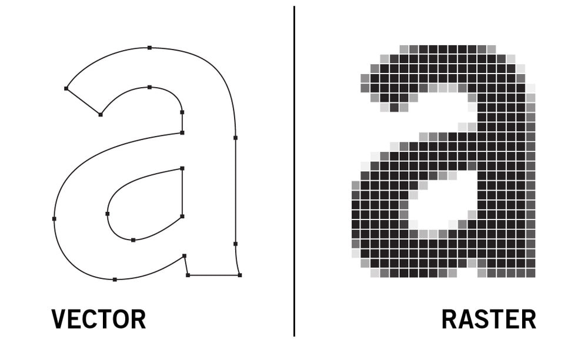

# **Rapports de Séance - Jaime Alba Pastor G2**

# Séance 0

Ce rapport correspond au travail fourni avant la première séance de TD.

- Ecriture du [README](../README.md)
- Ecriture des [étapes et tâches du project](../Documentation/Etapes-Taches.md)
- Ecriture du [CDC](../Documentation/Cahier_des_charges.md)

- Creation du [WorkSpace ClickUp](https://sharing.clickup.com/l/h/4-32571374-1/226c80c2a30dcb4)
- Répartition des tâches dans [WorkSpace ClickUp](https://sharing.clickup.com/l/h/4-32571374-1/226c80c2a30dcb4)
- Diagramme de Gantt dans [Diagramme-Gantt](../More/Images/Diagramme-Gantt.png)

# Séance 1

## Mercredi 01/12

J'ai préféré consacrer la première séance à l'organisation globale du projet, c'est à dire:

- Quelle forme et mécanismes le robot va avoir.
- Les [composants électroniques](../Documentation/Matériel.md) nécessaires.

**1. Mécanisme de ArtRobot.**

On s'est inspirés du système de robot de traçage [H-Robot](http://www.doublejumpelectric.com/projects/core_xy/2014-07-15-core_xy/) qui utilise une seule courrie dentée pour bouger selon les axes x et y.   

Il y a aussi un autre système similaire appelé CoreXY qui est supposé être un peu plus précis mais plus complexe à construire, donc on a décidé de conserver le H-Robot puisque nous voulons aussi implémenter le changement de couleur.

Pour le changement de couleurs on a pensé à **une croix** à laquelle seraient attachés les **différents stylos de couleurs à chacune des extrémités**. Lorsque l'on souhaiterait changer de couleur, on ferait **tourner la croix** grâce à un servo-moteur et ainsi positionner la couleur correspondante en direction de la feuille, prêt pour dessiner.

**2. Composants Electroniques**

Pour mener à bien ce projet on a besoin de 2 moteurs STEP ainsi que deux moteurs SERVO munis des drivers
correspondants. (listés dans les [matériels](../Documentation/Matériel.md))

## Jeudi 02/12

Je suis revenu le jour suivant avec mon groupe car j'avais très envie de continuer le projet.
J'ai passé une grande partie du temps à _collecter_ les matériaux d'un projet de l'année dernière (c'était un chaos !!).

- J'ai pu y trouver des petits boutons qui pourraient servir comme indicateurs au cas où la partie mobile collisionne avec les autres composants du robot. J'ai donc décidé de les incorporer prochainement.
- Nous avons besoin d'une courroie dentée d'environ 2m40, j'ai trouvé quelques courrois dentées (plus petites) que je vais agrafer entre elles pour faire une grande courroie.
- Finalement j'ai aussi récupéré des roulements linéaires à billes, des tubes en fer, deux moteurs NEMA-17 step bipolaires et les drivers.

Pour finir, j'ai commencé à tester le moteur NEMA-17.
Ce moteur ayant 4 cables (reliés 2 à 2), j'ai utilisé une petite astuce pour recconnaitre ceux qui vont ensemble. En tournant manuellement la partie mobile du moteur, un petit champ magnétique est généré puis transformé en courant (utilisation inverse du moteur). On peut donc créer un circuit **"fermé"** avec une résistance et une led qui s'allumera que lorsqu'il y aura un courant passant. On pourra alors identifier si le circuit est réellement fermé ou pas (si la led ne s'allume pas alors le circuit n'est pas fermé).  
[VideoYoutube](https://youtu.be/oWQ2Gkv-7zA)

**Remarque de M. Peter :**  
En tournant manuellement la partie mobile du moteur on ne peut pas deviner dans quel sens le courant va passer. C'est pour ça que si le courant généré est **trop important** et dans le **sens contraire à celui que la led accepte**, alors la led pourrait griller.

Puis j'ai procédé à tester le moteur (_avec la supervision de M. Jacquemod pour éviter de griller le driver_) avec un [petit programme](../More/Tests/StepMotorTest1.ino) récuperé dans le superbe cours de M.Masson. Le moteur a bien fonctionné.  

# Séance 2 - 16/12

Cette deuxième séance a été consacrée à la recherche et compréhension des fichiers .ino et programmes en c++.

Après avoir retesté le moteur pas à pas, je me suis rendu compte que l'utilisation de fonctions **delay()** dans le [programme](../More/Tests/StepMotorTest1.ino) sont totalement inserviables pour notre projet puisque les moteurs pas à pas doivent fonctionner indépendamment l'un de l'autre et au même temps. 

1. J'ai donc eu l'idée d'écrire ma propre librairie en m'informant sur le site officiel d'Arduino: [Writing a Library for Arduino](https://www.arduino.cc/en/Hacking/LibraryTutorial). Ceci m'a permis de mieux comprendre comment le language **c++** fonctionne et comment on peut **créer des classes** (deux types de fichiers: .cpp et .h).

2. Après m'être longtemps informé, une phrase m'est venue en tête: *"Tout problème qu'on puisse rencontrer a déjà été rencontré et résolu par quelqu'un d'autre"*. J'ai donc retrouvé des librairies comme **[AccelStepper](https://www.arduino.cc/reference/en/libraries/accelstepper/)** qui permettent de contrôler les moteurs pas à pas très facilement.

3. Puis j'ai lu la documentation du [Stepper Speed Control](https://www.arduino.cc/en/Tutorial/LibraryExamples/StepperSpeedControl) du site officiel Arduino mais qui utilise un autre type de driver ([SN75441 0ne H-Bridge](https://www.ti.com/lit/ds/symlink/sn754410.pdf)). Puis j'ai trouvé ce [site](https://www.makerguides.com/a4988-stepper-motor-driver-arduino-tutorial/) qui utilise notre **driver A4988** et qui explique très bien, étape par étape, comment le circuit et le [programme](../More/Tests/StepMotorPosition.ino) fonctionnent.

## Problème rencontré
Pour être sûr qu'avec la librairie **AccelStepper** on pouvait contrôler deux moteurs à la fois, j'ai préféré me renseigner avant de commencer à coder. En effet, j'ai bien fait de m'inquiéter puisque d'après ces sites plusieurs personnes ont rencontré des problèmes similaires :
- [Asynchronous stepper motor library](https://forum.dronebotworkshop.com/arduino/asynchronous-stepper-motor-library/)
- [non-blocking motor move for arduino](https://groups.google.com/g/accelstepper/c/wusHVDxhufw?pli=1)
- [linear motion with two steppers (AccelStepper)](https://forum.arduino.cc/t/linear-motion-with-two-steppers-accelstepper/126825)
- [simultaneous stepper motor control using accelstepper](https://forum.arduino.cc/t/simultaneous-stepper-motor-control-using-accelstepper/625179/2)

Il faudra donc que pour la troisième séance je me renseigne plus en détail sur les problèmes et solutions proposées. Et si jamais ça ne fonctionne pas, il faudra que je me penche sur ma dernière alternative, c'est-à-dire l'écriture de fonctions asynchrones et gestion des éventualités.

# Séance 3 - 06/01/22

En vue de la présentation du projet de la semaine prochaine, nous avons décidé d'accélerer la production car nous étions un peu en retard.  

## Partie Programmation
J'ai commencé par élaborer un récapitulatif du code avec les principales fonctions et variables: [Code_diagram.md](../Documentation/Code_diagram.md).  

J'ai repris l'idée de la **librairie turtle de python** qui permet de dessiner facilement sur une fenêtre et dont le fonctionnement ressemble particulièrement à ce dont on a besoin: une tortue (dans notre cas le stylo) qui se déplace en traçant des lignes derrière elle.

J'ai commencé à creer la [classe Pen](../Code/Pen.cpp) en utilisant la librairie *AccelStepper* pour simplifier le code. Je finirai cette partie avant la prochaine séance pour pouvoir faire des tests avec les pièces imprimées.

## Partie Mécanique
Après qu'Adrien ait terminé la modélisation des pièces, nous nous sommes dirigés vers le famlab pour la production. 

Nous avons discuté avec Frédéric Juan une méthode différente pour fabriquer les pièces car elles étaient trop grandes pour l'impression 3D.  
On a donc décidé de maintenir le support pour les moteurs et de créer une boite en bois pour ranger la plaque arduino et tous les cables. Ceci permet de maintenir le projet propre et organisé ainsi que plus élégant.  

J'ai donc téléchargé le fichier .svg du générateur de boîtes **[Box.py](https://www.festi.info/boxes.py/)**, et après modification avec **Inkscape**, nous avons coupé et assemblé les pièces de la boîte:  

D'autre part, l'une des pièces est en cour d'impression (j'irai la récupérer lundi) et si tout est correct on imprimera le reste.

# Séance 4 - Travail Maison

## Chez moi
J'ai monté le circuit pour tester les deux steper moteurs à la fois. Cependant un des moteurs tourne tout seul meme s'il est supposé être innactif.  

Pour comprendre le problème j'ai lu la tension à l'entrée "steps" du driver. Cette entrée sert à tourner le moteur d'un pas lorsque la valeur HIGH est envoyée. J'ai donc trouvé des valeurs HIGH et LOW aléatoires qui provoquaient le mouvement du moteur. 

Après demander l'avis de mes camarades, on a déduis que ce problème venait d'un bruit induit probablement par le courant 12V.  

J'ai donc demandé de l'aide à M. Masson qui m'a très aimablement pendant la soirée. Cependant on n'a pas pu trouver d'explication précise, et on a décidé de réessayer pendant la scéance où il serait présent.

## Au FabLab

Pour pouvoir commencer à faire des tests il nous faut que la partie mécanique soit finie.  
Au lieu d'imprimer les pièces en 3D, on les a produites en bois car c'est plus rapide et plus faciles à modifier si jamais il manque quelque chose.  

On a donc coupé les pièces avec le laser, perceuse, etc. Entre autres couper les barres en fer et couper les boîtes pour fixer les moteurs:  
  
Il ne manque plus qu'à finir la pièce du milieu pour coller et fixer l'ensemble des pièces.

# Séance 4 - 13/01/22

1 - Notre objectif le plus important est de **finir la partie mécanique** du projet. Il ne manque plus que la pièce centrale pour le support du stylo.  

On a donc choisit un mécanisme **simple** et à la fois **efficace** pour dessiner avec un seul stylo. De plus on pourra le changer plus tard afin de changer de couleur. *(Pièce produite par Adrien)*

2 - J'ai refait le montage du circuit pour tester les moteurs. Et, afin de **ne pas me tromper** et **soigner la présentation**, j'ai regroupé par fonctionnalité les cables avec du scotch: 

3 - J'ai donc testé à nouveau les moteurs et le même problème se produit: **un des moteurs bouge** tout seul.

J'ai donc  essayé de **recalibrer le potentiometre** du driver et on dirait que ça fonctionne. Cependant la **tension aux bornes** de l'un est bien plus **faible** que l'autre driver. Au moment où je ferai des tests avec la partie mécanique terminée je pourrai vérifier si le **couple** est assez grand ou pas.

4 - Pour finir j'ai cherché comment ajouter des fichiers **.h** ou **.cpp** pour éviter que tout le code soit trop compact. Ainsi on pourra appeler des fonctions définies dans un autre fichier.

# Séance 5 - Travail Maison

Un camarade de classe m'a recommandé un plugin de VSCode appelé **PlatFormIO** qui permet de controler l'arduino plus facilement. Tout est expliqué dans le fichier [EXPLICATION.md](../More/Useless/EXPLICATION.md) 

J'ai ajouté un **écran lcd** pour visualiser les actions pendant l'impression.
Cependant il y a eu un problème de code pour l'initialisation de l'objet **LiquidCristal** dans le fichier .h.  
Avec l'aide d'un camarade de SI on a pu trouver une solution et faire fonctionner l'écran.  

## Dessin vectoriel d'une image

Je me suis renseigné sur les **CNC machines** (Computer Numerical Control) et comment elles réussissent à tracer des figures. J'ai trouvé le **G-Code**, un language qui se traduit par un ensemble de vecteurs et qui permet à la machine de bouger dans la direction souhaitée.  

Il y a 2 **tipes de G-Code**: Vector (image vectorielle) et Raster (image bitmap).

Le dessin d'une image vectorielle est plus rapide mais les détails sont souvent perdus. Et le dessin d'une image bitmap met beaucoup plus de temps mais tous les éléments sont dessinés, mais avec une qualité moin bonne.

### Premiers test

J'ai utilisé **Inkscape** pour exporter l'image en G-Code puis utilisé le logiciel **CAMotics** pour visualiser le rendu étant donné que la martie mécanique de ArtBot n'est pas encore finie.  

Voici une **[vidéo récapitulative](https://youtu.be/TPImFBnE6Mc)** avec une démo.  
Il ne reste plus qu'à comprendre le format G-Code et le traduire en code pour notre machine.

# Séance 5 - 02/02/2022

Cette séance j'étais très motivé pour résoudre le probleme qui me tracasse pendant des semaines. Un bruit **mistérieux** qui fait bouger les moteurs aléatoirement.  
Avec l'aide de M. Masson, on a vérifié que les moteurs et les drivers n'étaient pas cassés. Pour les drivers il a fallu ajuster le **potentiomètre interne** pour laisser passer plus de courrant et que le couple des moteurs soit plus élevé.  
À part ça tout fonctionnait correctement et j'ai donc supposé que *l'erreur venait du code*. Après un bon lapse de temps j'ai tenté d'initialiser les pinMode au début du code au cas où la librairie LiquidCristal ne le faisait pas automatiquement. Et bingo ! Grâce à ça il n'y avait plus de bruit. 

On a aussi fini de monter les pièces de la machine et ajuster la courroie dentée pour avoir une distance parfaite.  
Puis l'après midi je suis revenu au FabLab pour ajouter des *petits morceaux en bois* utilisés pour **élever en hauteur les roulements**. Sinon la courroie touchait la pièce centrale.  

Voici le rendu:  
    

Je vais enfin pouvoir commencer à faire des tests !

Note pour la prochaine séance: ajouter deux autres roulements dans l'axe y, sinon ils bloquent parfois.

# Séance 6 - 09/02/2022

Tout d'abord j'ai **désinstallé le plugin PlatformIO** parce que je ne l'ai pas configuré correctement et cela prend pas mal de temps.  
J'ai donc décidé de me centrer sur le code sur l'**IDE Arduino** pour ne pas avoir de complications.  
Je regarderai plus en détail PlatformIO après le projet.  

Pendant que mon camarade modifiait la partie mécanique j'ai regardé comment *envoyer un fichier G-Code vers l'arduino* et le traduire en commandes pour dessiner.  
Le [modèle d'inspiration](https://github.com/arnabdasbwn/grbl-coreXY-servo) utilise la **librairie GRBL modifiée** pour cette machine en particulier. Cependant, même avec l'aide de Mme. Benouakta, je n'ai pas réussi à comprendre le code et comment l'utiliser.  
Je vais donc regarder des vidéos de comment utiliser la librairie GRBL originelle et essayer de l'adapter à notre projet.  
https://lebearcnc.com/installer-grbl-sur-larduino-televerser/  

J'ai aussi trouvé **UGS Platform** un nouveau moyen très efficace d'envoyer du G-Code.

Une fois la partie mécanique finie, j'ai commencé à faire des **tests** mais le programme ne fonctionnait pas correctement.  
J'ai eu beaucoup de mal à retrouver l'erreur parce que je ne contrôle pas très bien le langage C++.  
Finalement j'ai trouvé que la **librairie AccelStepper** ne fais pas ce que lui est demandé. Je vais donc m'informer pendant la semaine de vacances pour la faire fonctionner.  

Pour finir, on a remarqué ou plutôt toute la classe a remarqué que notre machine faisait beaucoup **trop de bruit** lorsqu'elle bougeait. Ceci était causé parceque la pièce centrale n'était pas accrochée sur son centre mais sur un côté. Ceci causait beaucoup de **vibrations**.  
J'ai donc réutilisé et modifié une pièce d'un projet précédent pour l'accrocher par le centre. 

